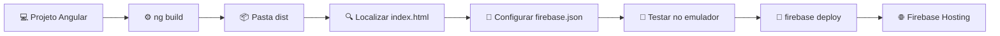

# 📘 Deploy de Angular no Firebase Hosting

> Documentação técnica para publicar uma aplicação Angular no Firebase Hosting.  
> **Nível:** intermediário → avançado  
> **Última atualização:** agosto de 2026

[](https://angular.dev/)
[](https://firebase.google.com/docs/hosting)
[](https://nodejs.org/)
[](https://firebase.google.com/docs/cli)

---

## 📑 Tabela de conteúdos
| | Seção | Conteúdo |
|:---:|---|---|
| 🚀 | **[1. Visão geral](#1-visão-geral)** | Objetivo da documentação e funcionamento do fluxo Angular → Firebase Hosting |
| 🧰 | **[2. Preparação](#2-preparação)** | Pré-requisitos, ferramentas necessárias e projeto utilizado como exemplo |
| ⚙️ | **[3. Configuração inicial](#3-configuração-inicial)** | Instalação do Firebase CLI, autenticação e associação do projeto |
| 🏗️ | **[4. Build da aplicação](#4-build-da-aplicação)** | Compilação do Angular e localização do `index.html` |
| 🔧 | **[5. Configuração do Hosting](#5-configuração-do-hosting)** | Configuração do `firebase.json`, pasta `public` e regras de rewrite |
| 🧪 | **[6. Validação local](#6-validação-local)** | Execução do emulador e testes antes da publicação |
| 🌐 | **[7. Deploy em produção](#7-deploy-em-produção)** | Publicação da aplicação no Firebase Hosting |
| 🔁 | **[8. Próximos deploys](#8-próximos-deploys)** | Fluxo recomendado para atualizações futuras |
| 📁 | **[9. Estrutura do projeto](#9-estrutura-do-projeto)** | Organização dos arquivos Angular e Firebase |
| 🛠️ | **[10. Troubleshooting](#10-troubleshooting)** | Solução dos erros mais comuns |
| 🧠 | **[11. Boas práticas](#11-boas-práticas)** | Preview channels, aliases, segurança e otimização |
| ✅ | **[12. Checklist final](#12-checklist-final)** | Lista de validação antes do primeiro deploy |
| 🔗 | **[13. Referências oficiais](#13-referências-oficiais)** | Links oficiais do Angular, Firebase e Firebase CLI |
### Fluxo visual

### Estrutura da documentação
```text
📘 Deploy Angular + Firebase Hosting
│
├── 🚀 Visão geral
├── 🧰 Preparação
├── ⚙️ Configuração inicial
├── 🏗️ Build da aplicação
├── 🔧 Configuração do Hosting
├── 🧪 Validação local
├── 🌐 Deploy em produção
├── 🔁 Próximos deploys
├── 📁 Estrutura do projeto
├── 🛠️ Troubleshooting
├── 🧠 Boas práticas
├── ✅ Checklist final
└── 🔗 Referências oficiais

---

## 🎯 Objetivo

Este guia mostra como conectar um projeto Angular existente a um projeto já criado no Firebase e publicá-lo utilizando o Firebase Hosting.

O processo inclui:

- Instalação e autenticação do Firebase CLI.
- Associação do projeto Angular ao projeto Firebase.
- Configuração do Firebase Hosting.
- Geração do build de produção.
- Configuração de rotas para uma aplicação Single-Page Application.
- Teste local e deploy da aplicação.

O Firebase utiliza o arquivo `firebase.json` para definir o comportamento do Hosting, incluindo a pasta pública, arquivos ignorados, rewrites e redirects. [1]

***

## 🔄 Como funciona

O Angular não publica diretamente os arquivos presentes em `src/`. Primeiro, o projeto precisa ser compilado com `ng build`, que transforma o código TypeScript em JavaScript e gera os arquivos otimizados da aplicação. [3]

O Firebase Hosting publica somente a pasta definida na propriedade `hosting.public` do arquivo `firebase.json`.

```text
Código-fonte Angular
        ↓
ng build --configuration production
        ↓
Pasta dist/
        ↓
Firebase Hosting
        ↓
Aplicação publicada
```

> **Regra de ouro:** o valor de `hosting.public` precisa apontar para a pasta que contém diretamente o `index.html` gerado pelo build.

***

## ✅ Pré-requisitos

Antes de iniciar, certifique-se de que possui:

| Requisito | Recomendação |
|---|---|
| Node.js | Versão compatível com o Angular utilizado |
| npm | Instalado junto com o Node.js |
| Angular CLI | Compatível com a versão do projeto |
| Firebase CLI | Versão atual |
| Conta Google | Com acesso ao projeto Firebase |
| Projeto Firebase | Criado no Firebase Console |
| Projeto Angular | Existente e compilando localmente |
| VS Code | Recomendado, mas opcional |

Valide as ferramentas instaladas:

```bash
node --version
npm --version
ng version
```

<p>
  <a href="https://nodejs.org/">
    
  </a>
  <a href="https://angular.dev/tools/cli">
    
  </a>
  <a href="https://firebase.google.com/docs/cli">
    
  </a>
</p>

***

## 🧪 Exemplo utilizado

Neste documento, serão utilizados os seguintes nomes fictícios:

| Item | Valor |
|---|---|
| Projeto Angular | `Shadow-Flip-Angular` |
| Projeto Firebase | `shadow-angular` |
| URL esperada | `https://shadow-angular.web.app` |

Substitua esses valores pelos nomes reais do seu projeto.

***

## 🚀 Passo a passo

### 1. Instalar o Firebase CLI

Abra o terminal integrado do VS Code e execute:

```bash
npm install -g firebase-tools
```

Verifique se a instalação foi concluída:

```bash
firebase --version
```

Exemplo de saída:

```text
15.27.0
```

Se o comando `firebase` não for reconhecido, reinicie o terminal do VS Code. Caso o problema persista, verifique o diretório global do npm:

```bash
npm prefix -g
```

<p>
  <a href="https://firebase.google.com/docs/cli">
    
  </a>
</p>

***

### 2. Fazer login no Firebase

Execute:

```bash
firebase login
```

O navegador será aberto para autenticação com sua conta Google.

Depois do login, liste os projetos disponíveis:

```bash
firebase projects:list
```

O projeto criado no Firebase Console deverá aparecer na lista.

Exemplo:

```text
Project Display Name    Project ID
shadow-angular          shadow-angular
```

***

### 3. Entrar na pasta do projeto

Navegue até a pasta raiz do projeto Angular:

```bash
cd caminho/do/seu/projeto
```

#### Windows

```powershell
cd "C:\Projects\Shadow-Flip-Angular"
```

#### macOS ou Linux

```bash
cd ~/Projects/Shadow-Flip-Angular
```

Confirme se está na pasta correta.

#### Windows

```powershell
dir
```

#### macOS ou Linux

```bash
ls
```

A pasta deverá conter arquivos ou diretórios semelhantes a:

```text
angular.json
package.json
src/
```

***

### 4. Associar o projeto Angular ao Firebase

Execute:

```bash
firebase use --add
```

Selecione o projeto Firebase desejado e defina um alias, por exemplo:

```text
default
```

Esse processo cria ou atualiza o arquivo `.firebaserc`:

```json
{
  "projects": {
    "default": "shadow-angular"
  }
}
```

Confirme o projeto atualmente selecionado:

```bash
firebase use
```

A saída deverá indicar o projeto ativo:

```text
Active Project: shadow-angular
```

***

### 5. Inicializar o Firebase Hosting

Execute:

```bash
firebase init hosting
```

Durante o assistente, selecione ou informe:

| Pergunta | Resposta recomendada |
|---|---|
| Use an existing project? | Sim |
| Projeto Firebase | `shadow-angular` |
| Public directory | Será definido após verificar o build |
| Configure as a single-page app? | Sim |
| Set up automatic builds with GitHub? | Opcional |

Se preferir iniciar o Firebase manualmente, execute:

```bash
firebase init
```

Nesse caso, selecione apenas o recurso de Hosting:

```text
Hosting: Configure files for Firebase Hosting and optionally set up GitHub Action deploys
```

Não é necessário selecionar Firestore, Functions, Storage ou outros produtos quando o objetivo for apenas publicar o front-end Angular.

O comando `firebase init` cria o arquivo `firebase.json` na raiz do projeto, arquivo utilizado para configurar os recursos do Firebase. [2]

***

### 6. Gerar o build de produção

Execute:

```bash
ng build --configuration production
```

Também é possível utilizar o script padrão do projeto:

```bash
npm run build
```

O Angular exibirá o diretório de saída do build.

Em projetos recentes, a estrutura poderá ser semelhante a:

```text
dist/
└── shadow-flip-angular/
    └── browser/
        ├── index.html
        ├── main-XXXXXXXX.js
        ├── styles-XXXXXXXX.css
        └── assets/
```

Em outros projetos, o `index.html` poderá estar diretamente em:

```text
dist/shadow-flip-angular/
```

> Não presuma o caminho da pasta `public`. Sempre confirme onde o build realmente gerou o `index.html`.

***

### 7. Localizar o `index.html`

#### PowerShell

Execute na raiz do projeto:

```powershell
Get-ChildItem . -Filter index.html -Recurse | Select-Object FullName
```

Exemplo de resultado:

```text
C:\Projects\Shadow-Flip-Angular\dist\shadow-flip-angular\browser\index.html
```

Nesse caso, a pasta correta para o Firebase Hosting será:

```text
dist/shadow-flip-angular/browser
```

#### macOS ou Linux

```bash
find . -type f -name "index.html"
```

O valor configurado em `public` deve ser a pasta que contém o arquivo, e não o caminho completo do arquivo.

#### Correto

```text
dist/shadow-flip-angular/browser
```

#### Incorreto

```text
dist/shadow-flip-angular/browser/index.html
```

***

### 8. Configurar o `firebase.json`

Abra o arquivo `firebase.json` na raiz do projeto e configure-o conforme a localização real do `index.html`.

#### Exemplo com a pasta `browser`

```json
{
  "hosting": {
    "public": "dist/shadow-flip-angular/browser",
    "ignore": [
      "firebase.json",
      "**/.*",
      "**/node_modules/**"
    ],
    "rewrites": [
      {
        "source": "**",
        "destination": "/index.html"
      }
    ]
  }
}
```

#### Exemplo sem a pasta `browser`

Se o arquivo estiver em:

```text
dist/shadow-flip-angular/index.html
```

utilize:

```json
{
  "hosting": {
    "public": "dist/shadow-flip-angular",
    "ignore": [
      "firebase.json",
      "**/.*",
      "**/node_modules/**"
    ],
    "rewrites": [
      {
        "source": "**",
        "destination": "/index.html"
      }
    ]
  }
}
```

#### Significado das propriedades

| Propriedade | Finalidade |
|---|---|
| `public` | Define a pasta que será publicada |
| `ignore` | Impede o envio de arquivos desnecessários |
| `rewrites` | Encaminha determinadas URLs para outro recurso |
| `source` | Define o padrão de URL correspondente |
| `destination` | Define o destino da requisição |

O Firebase permite configurar no `firebase.json` quais arquivos serão publicados e como as URLs serão processadas. [1]

#### Por que usar `rewrites`?

O Angular utiliza roteamento no navegador. Rotas como as seguintes podem não existir como arquivos físicos:

```text
/
/projects
/about
/contact
```

Sem um rewrite, o Firebase poderá procurar um arquivo físico chamado `projects`, `about` ou `contact` e retornar uma página 404.

A regra abaixo entrega o `index.html` para essas rotas:

```json
"rewrites": [
  {
    "source": "**",
    "destination": "/index.html"
  }
]
```

Depois disso, o Angular Router interpreta a URL e renderiza o componente correspondente.

> A configuração acima é indicada para aplicações Angular client-side. Projetos com SSR possuem requisitos diferentes e devem ser configurados conforme a arquitetura utilizada.

***

### 9. Testar localmente

Antes do deploy, gere o build:

```bash
ng build --configuration production
```

Depois, inicie o emulador do Hosting:

```bash
firebase emulators:start --only hosting
```

O Firebase exibirá uma URL local, normalmente semelhante a:

```text
http://127.0.0.1:5000
```

Valide:

- Página inicial.
- Rotas internas.
- Atualização da página em uma rota profunda.
- Imagens e arquivos da pasta `assets`.
- Responsividade.
- Console do navegador.
- Links externos.
- Integrações com APIs.

Para encerrar o emulador:

```text
Ctrl + C
```

O Firebase Hosting oferece um emulador local para testar alterações antes da publicação em produção. [4]

***

### 10. Fazer o deploy

Depois de validar o build e o `firebase.json`, execute:

```bash
firebase deploy --only hosting
```

Ao final, será exibida uma mensagem semelhante a:

```text
Deploy complete!

Hosting URL: https://shadow-angular.web.app
```

Abra a URL no navegador e valide a aplicação em produção.

O comando `firebase deploy --only hosting` publica somente os recursos relacionados ao Firebase Hosting. [5]

<p>
  <a href="https://firebase.google.com/docs/hosting">
    
  </a>
</p>

***

## 🔁 Fluxo dos próximos deploys

Depois que a configuração inicial estiver pronta, o processo será:

```bash
ng build --configuration production
firebase deploy --only hosting
```

Você também pode criar scripts no `package.json`:

```json
{
  "scripts": {
    "build:production": "ng build --configuration production",
    "deploy:hosting": "npm run build:production && firebase deploy --only hosting"
  }
}
```

Depois, execute apenas:

```bash
npm run deploy:hosting
```

O comando abaixo poderá publicar outros recursos Firebase configurados no projeto:

```bash
firebase deploy
```

Para publicar somente o site, prefira:

```bash
firebase deploy --only hosting
```

***

## 📁 Estrutura do projeto

Uma estrutura típica poderá ser:

```text
Shadow-Flip-Angular/
├── dist/
│   └── shadow-flip-angular/
│       └── browser/
│           ├── index.html
│           ├── main-XXXXXXXX.js
│           ├── styles-XXXXXXXX.css
│           └── assets/
├── src/
│   ├── app/
│   ├── assets/
│   ├── index.html
│   ├── main.ts
│   └── styles.scss
├── .firebaserc
├── firebase.json
├── angular.json
├── package.json
├── package-lock.json
└── tsconfig.json
```

A pasta `dist/` é gerada automaticamente pelo processo de build e não deve ser editada manualmente.

***

## 🛠️ Troubleshooting

### `firebase` não é reconhecido

Instale ou reinstale o Firebase CLI:

```bash
npm install -g firebase-tools
```

Depois, reinicie o terminal e valide:

```bash
firebase --version
```

Se o problema persistir, consulte o diretório global do npm:

```bash
npm prefix -g
```

***

### Erro `Page Not Found`

Verifique:

- Se o build foi executado.
- Se o `index.html` existe.
- Se `hosting.public` aponta para a pasta correta.
- Se o deploy foi executado depois da alteração.
- Se não existe outro `firebase.json` em uma pasta diferente.

Localize o arquivo:

```powershell
Get-ChildItem . -Filter index.html -Recurse | Select-Object FullName
```

***

### Erro `Could not detect project root`

Execute os comandos dentro da pasta que contém:

```text
angular.json
package.json
src/
```

***

### Rotas internas retornam 404

Confirme se o `firebase.json` possui:

```json
"rewrites": [
  {
    "source": "**",
    "destination": "/index.html"
  }
]
```

Depois, gere o build novamente e faça um novo deploy:

```bash
ng build --configuration production
firebase deploy --only hosting
```

***

### Alterações não aparecem no navegador

Tente:

- Atualizar a página com `Ctrl + F5`.
- Abrir uma janela anônima.
- Limpar o cache do navegador.
- Confirmar se o deploy foi concluído.
- Verificar a URL correta do projeto Firebase.

***

### Arquivos estáticos não carregam

Confirme:

- Se os arquivos estão dentro de `src/assets`.
- Se o caminho utilizado no código está correto.
- Se os assets estão configurados no `angular.json`.
- Se o caminho respeita letras maiúsculas e minúsculas.

Exemplo:

```html

```

***

## 🧠 Boas práticas

### Use build de produção

Para publicar, prefira:

```bash
ng build --configuration production
```

Esse perfil normalmente aplica otimizações como:

- Minificação.
- Tree-shaking.
- Otimização de bundles.
- Remoção de código não utilizado.
- Geração de arquivos prontos para produção.

O Angular CLI realiza a compilação e a otimização da aplicação durante o processo de build. [3]

***

### Não versione a pasta `dist`

Adicione ao `.gitignore`:

```gitignore
dist/
.firebase/
```

***

### Teste antes de publicar

Use o emulador do Hosting:

```bash
firebase emulators:start --only hosting
```

***

### Use canais de preview

Para gerar uma publicação temporária:

```bash
firebase hosting:channel:deploy preview
```

O Firebase fornecerá uma URL de preview que poderá ser compartilhada para validação antes do deploy em produção.

***

### Use aliases para ambientes

Exemplo de `.firebaserc`:

```json
{
  "projects": {
    "development": "shadow-angular-dev",
    "staging": "shadow-angular-staging",
    "production": "shadow-angular"
  }
}
```

Para selecionar um ambiente:

```bash
firebase use production
```

Depois, execute:

```bash
firebase deploy --only hosting
```

Antes de executar um deploy, confirme sempre o projeto ativo:

```bash
firebase use
```

***

### Evite publicar arquivos sensíveis

Nunca coloque no diretório público:

- Chaves privadas.
- Arquivos `.env` com segredos.
- Credenciais de service account.
- Tokens de acesso.
- Arquivos administrativos do Firebase.

> A configuração do Firebase no front-end não deve conter credenciais privadas. Segredos devem permanecer em ambientes protegidos no back-end ou no pipeline de CI/CD.

***

## ✅ Checklist final

Antes do primeiro deploy:

- [ ] Node.js instalado.
- [ ] npm funcionando.
- [ ] Angular CLI disponível.
- [ ] Firebase CLI instalado.
- [ ] Login realizado com `firebase login`.
- [ ] Projeto Firebase selecionado.
- [ ] Projeto Angular compilando localmente.
- [ ] Build de produção gerado.
- [ ] `index.html` localizado.
- [ ] `hosting.public` apontando para a pasta correta.
- [ ] `rewrites` configurado para o Angular Router.
- [ ] Emulador local validado, quando necessário.
- [ ] Deploy executado com `firebase deploy --only hosting`.
- [ ] URL de produção testada.
- [ ] Rotas internas testadas.
- [ ] Assets e imagens validados.
- [ ] Console do navegador revisado.

***

## 📚 Referências oficiais

<p>
  <a href="https://firebase.google.com/docs/hosting">
    
  </a>
  <a href="https://firebase.google.com/docs/cli">
    
  </a>
  <a href="https://angular.dev/tools/cli">
    
  </a>
</p>

- [Firebase Hosting](https://firebase.google.com/docs/hosting)
- [Firebase CLI](https://firebase.google.com/docs/cli)
- [Get started with Firebase Hosting](https://firebase.google.com/docs/hosting/quickstart)
- [Integração entre Angular e Firebase Hosting](https://firebase.google.com/docs/hosting/frameworks/angular)
- [Configuração completa do `firebase.json`](https://firebase.google.com/docs/hosting/full-config)
- [Documentação do Angular CLI](https://angular.dev/tools/cli)
- [Build de aplicações Angular](https://angular.dev/tools/cli/build)

***

## 📌 Regra mais importante

O valor de `public` no `firebase.json` deve apontar para a pasta que contém diretamente o `index.html` gerado pelo build.

Exemplo:

```json
{
  "hosting": {
    "public": "dist/shadow-flip-angular/browser"
  }
}
```

Se o Firebase exibir uma página `Page Not Found` ou informar que não encontrou o `index.html`, verifique:

1. O resultado do `ng build`.
2. A localização real do `index.html`.
3. O valor de `hosting.public`.
4. A configuração de `rewrites`.
5. Se o deploy foi executado novamente.

---

<div align="center">

[](#-deploy-de-angular-no-firebase-hosting)

</div>